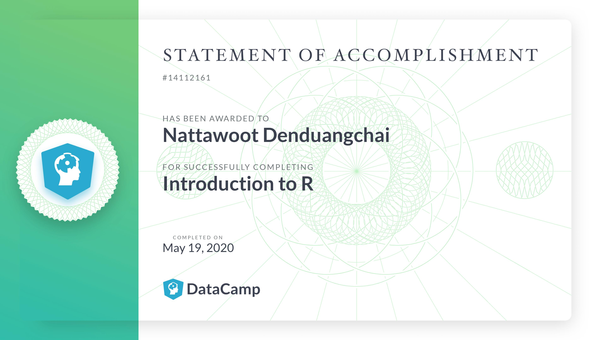

# Introduction to R

### Course Description

In Introduction to R, you will master the basics of this widely used open source language, including factors, lists, and data frames. With the knowledge gained in this course, you will be ready to undertake your first very own data analysis. Oracle estimated over 2 million R users worldwide in 2012, cementing R as a leading programming language in statistics and data science. Every year, the number of R users grows by about 40%, and an increasing number of organizations are using it in their day-to-day activities. Begin your journey to learn R with us today!